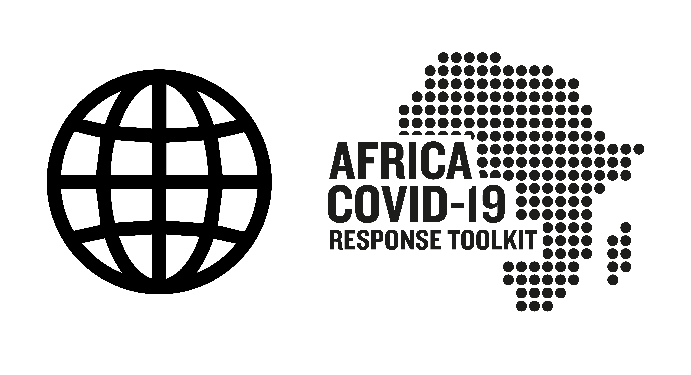

<div align="center">
  
</div>

<!-- ALL-CONTRIBUTORS-BADGE:START - Do not remove or modify this section -->
[](#contributors-)
<!-- ALL-CONTRIBUTORS-BADGE:END -->

# CoVID-19 Awareness Site

## Copy the `.env.example` to `.env` and adjust the values as necessary.

## View current build (Builds from master branch)

```
ethiopia-covid19.com
```

## Project setup

```
npm install
```

### Compiles and hot-reloads for development

```
npm run serve
```

### Compiles and minifies for production

```
npm run build
```

### Lints and fixes files

```
npm run lint
```

### Customize configuration

See [Configuration Reference](https://cli.vuejs.org/config/).

## Contributors ✨

Thanks goes to these wonderful people ([emoji key](https://allcontributors.org/docs/en/emoji-key)):

<!-- ALL-CONTRIBUTORS-LIST:START - Do not remove or modify this section -->
<!-- prettier-ignore-start -->
<!-- markdownlint-disable -->
<table>
  <tr>
    <td align="center"><a href="https://github.com/tgd-oss"><br /><sub><b>tgd-oss</b></sub></a><br /><a href="https://github.com/Ethiopia-COVID19/covid-19-homepage/commits?author=tgd-oss" title="Code">💻</a></td>
    <td align="center"><a href="https://github.com/abelhbeyene"><br /><sub><b>Abel</b></sub></a><br /><a href="https://github.com/Ethiopia-COVID19/covid-19-homepage/commits?author=abelhbeyene" title="Code">💻</a></td>
  </tr>
</table>

<!-- markdownlint-enable -->
<!-- prettier-ignore-end -->
<!-- ALL-CONTRIBUTORS-LIST:END -->

This project follows the [all-contributors](https://github.com/all-contributors/all-contributors) specification. Contributions of any kind welcome!
